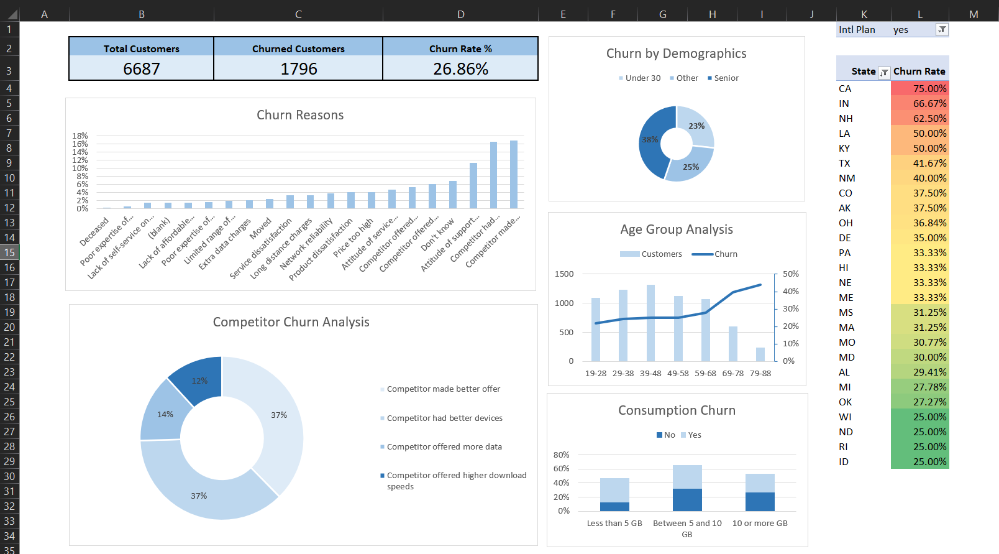

# Customer Churn Analysis Project

This project provides an in-depth analysis of customer churn using Excel. It includes identifying key factors contributing to churn, demographic breakdowns, and visualized insights through dashboards and charts. The analysis also explores hypotheses, contract types, and international activity trends, offering actionable insights.

## **Overview**

- **Objective**: To analyze customer churn data and provide insights using advanced Excel techniques.
- **Dataset**:  
  This project uses a dataset containing customer information and churn details, including demographics, contract types, usage patterns, and reasons for churn.  
  - **Raw Data**: [Customer Data](customer_data.csv)  
  - **Detailed Description**: For a full breakdown of the dataset columns and their meanings, see the [Dataset Description](data_description.md).  
- **Tools Used**: Microsoft Excel.

## **Key Highlights**

1. **Churn Rate Analysis**:
   - Calculated churn rate as a percentage of total customers.
   - **Overall Churn Rate**: 26.86%.

2. **Churn Reasons**:
   - Identified top churn reasons through PivotTables:
     - Competitor made a better offer: **303 customers (16.87%)**.
     - Competitor had better devices: **297 customers (16.54%)**.
     - Attitude of support person: **203 customers (11.30%)**.

3. **Demographic Insights**:
   - Seniors have the highest churn rate at **38.46%**.
   - Age group **79-88** shows the lowest number of customers but the highest churn rate (**43.80%**).

4. **Usage Behavior**:
   - Customers on unlimited data plans with low usage (<5 GB) churn at a rate of **34.71%**.
   - Overall churn rate for unlimited plans: **32.11%** compared to **16.10%** for non-unlimited plans.

5. **International Plan Analysis**:
   - **California** has the highest churn rate for customers with international plans at **75.00%**.

6. **Contract Insights**:
   - **Month-to-Month contracts** exhibit the highest churn rate at **53.82%**.
   - Long-term customers on 1-year contracts churn more frequently than those on 2-year contracts.

## **Procedures**

1. Converted the raw dataset into a tabular format and cleaned it for analysis.
2. Created new calculated fields, including:
   - `Churned`: Binary indicator (1 for churned, 0 for not churned).
   - `Total Customers`: Representing the total customers for each row.
3. Built dynamic PivotTables to analyze churn by:
   - Reason, category, demographic group, age range, and contract type.
4. Developed visualizations:
   - Bar charts for churn reasons.
   - Line and clustered column charts for age-based churn rates.
   - Stacked bar charts for churn rate by data usage.
5. Designed an interactive dashboard:
   - Summarized churn metrics and key visuals.
   - Included top churn states, competitor category analysis, and demographic trends.

## **Key Findings**

- Competitor-related churn reasons are the most common drivers of churn.
- Seniors and customers on month-to-month contracts are at the highest risk of churning.
- Customers with minimal data usage (<5 GB) on unlimited plans are more likely to churn.

## **Dashboard**

The Excel dashboard consolidates key metrics, including churn rate, demographic breakdowns, and visualized insights.  

## **Future Improvements**

- Extend the analysis to predict churn likelihood using machine learning.

- Automate dashboard updates with Power Query or VBA macros.

- Add deeper insights into senior churn categories.
